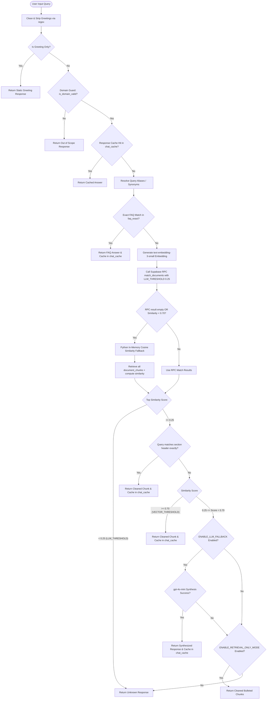
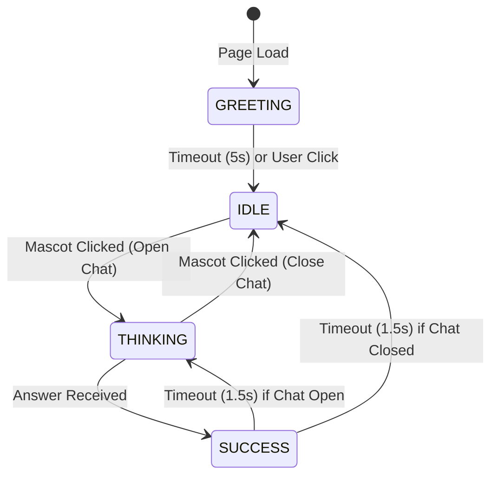

# HackX Assistant V1.0 Architecture

This document describes the design, routing mechanisms, and frontend state animations of the HackX Assistant V1.0, a lightweight, RAG-powered chatbot designed for the HackX 11.0 and HackX Jr 9.0 events.

---

## 1. System Pipeline Blueprint

The assistant employs an **LLM-Last Architecture** to maximize performance, minimize latency, and minimize OpenAI API usage costs. The flowchart below maps the complete question-answering lifecycle:



---

## 2. 6-Tier Execution Pipeline Details

1. **Domain Guard (Tier 1)**: Checks the input question against keyword filters. Unrelated requests are rejected immediately without hitting databases, embeddings, or LLMs.
2. **Response Cache Check (Tier 2)**: Checks if the query exists in `chat_cache`. If present, returns the cached answer instantly.
3. **Exact FAQ Match (Tier 4)**: Checks resolved synonyms/aliases and performs a query against `faq_exact` in Supabase.
4. **Vector Search (Tier 5 - Cosine Similarity >= 0.70)**: Computes embeddings with `text-embedding-3-small` and calls Supabase RPC `match_documents`. If results are empty or top similarity is < `0.70`, a **Python in-memory cosine similarity fallback** is triggered. If the final top similarity is `>= 0.70` or the query matches a section header exactly, the chunk is returned directly.
5. **LLM Synthesis (Tier 6)**: If similarity is between `0.25` and `0.70`, and `ENABLE_LLM_FALLBACK` is enabled, it synthesizes a response using `gpt-4o-mini` with conversation context.
6. **Emergency Fallback (Tier 6 - Recovery Mode)**: If LLM fails or is disabled, and `ENABLE_RETRIEVAL_ONLY_MODE` is enabled, the system returns bulleted, cleaned raw retrieved chunks.

---

## 3. Frontend Mascot State Engine

The assistant features an interactive mascot launcher that changes poses to match the conversation flow.

### Mascot States:
- **GREETING** (`mascot-one-handed.png`): Displayed on page load along with a welcoming speech bubble.
- **IDLE** (`mascot-one-handed.png`): Default floating/breathing state when the chat panel is closed.
- **THINKING** (`mascot-with-lap.png`): Active when the chat panel is open or while waiting for a backend response.
- **SUCCESS** (`mascot-two-handed.png`): Triggered for 1.5 seconds when an answer is delivered.



---

## 4. UI Design System Tokens

The frontend widget is styled with modern CSS variables to ensure consistency and modularity:

```css
:root {
    --hackx-bg: #020617;          /* Deep dark blue */
    --hackx-card: #0f172a;        /* Muted slate blue cards */
    --hackx-primary: #2563eb;     /* Electric Blue brand color */
    --hackx-cyan: #22d3ee;        /* High-tech Cyan highlights */
    --hackx-warning: #f59e0b;     /* Amber alerts */
    --hackx-success: #22c55e;     /* Online status indicators */
    --hackx-text: #ffffff;        /* Primary text */
    --hackx-muted: #94a3b8;       /* Slate gray text details */
    --hackx-border: #1e293b;      /* Panel border boundaries */
}
```
